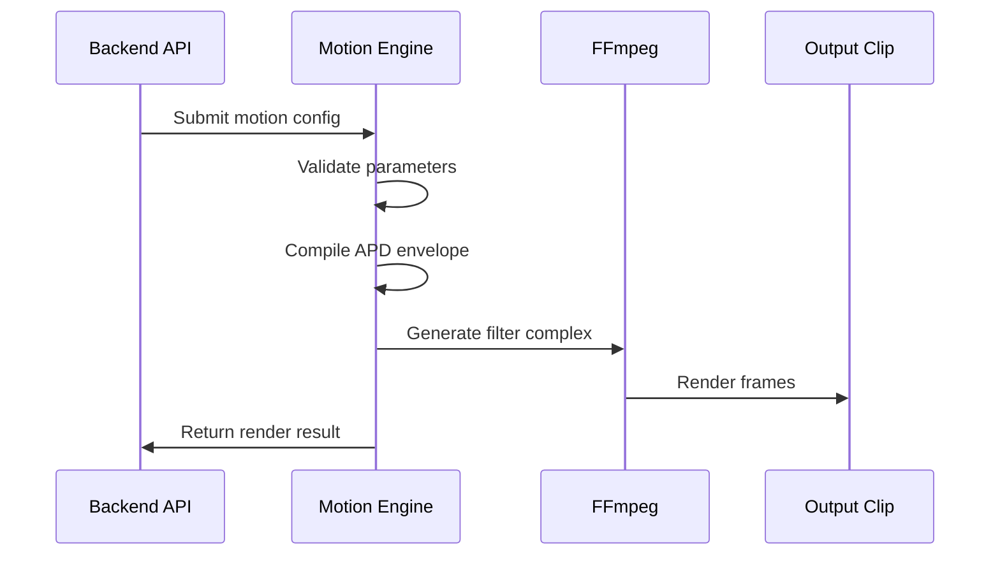
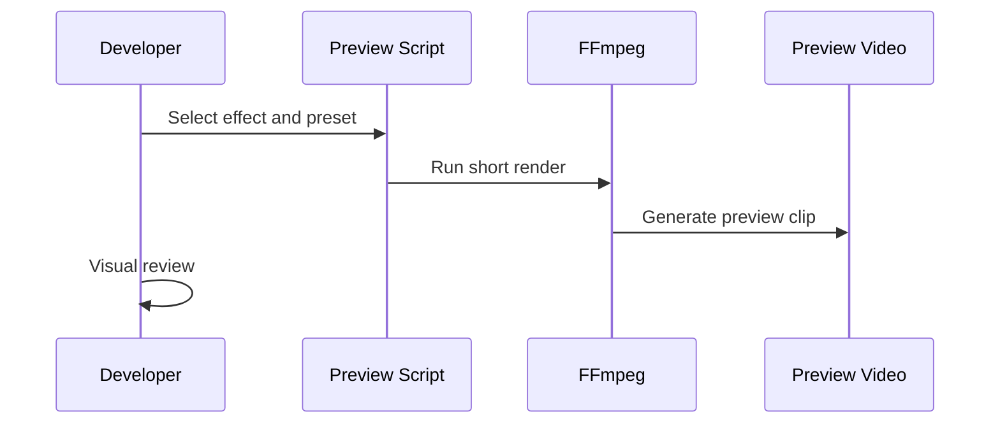

# FFmpeg Motion Engine(My Approach)
Human Like Native Motion Effects for Production Pipelines

Author: Vishnu  
Senior Backend and Production Engineer  
Focus: FFmpeg motion systems, deterministic rendering, automation reliability

---

## Project Overview

This project delivers a **reusable, production grade FFmpeg motion engine** capable of
producing **human like camera motion** such as shake, zoom punches, reverse bursts, and
speed ramps using **pure filter_complex mathematics**.

The system is designed for **backend driven video pipelines**, not manual editing.
All motion is **deterministic, parameterized, previewable, and safe to retry**.

The objective is to match **After Effects quality motion curves** while remaining
fully native to FFmpeg and suitable for automation.

---

## Core Problem This Solves

Most FFmpeg motion implementations fail because they rely on:
- Linear interpolation
- Random jitter
- Hard coded presets
- No envelope control
- No retry safety

This engine solves that by treating motion as a **compiled system**, not a visual effect.

---

## High Level Architecture

```mermaid
flowchart LR
    CLIENT[Backend API]
    CONFIG[Motion Config JSON]
    VALIDATE[Validation Layer]
    ENGINE[Motion Engine APD Compiler]
    FFMPEG[FFmpeg Filter Complex]
    OUTPUT[Rendered Clip]
    LOGS[Logs and Metrics]

    CLIENT --> CONFIG
    CONFIG --> VALIDATE
    VALIDATE --> ENGINE
    ENGINE --> FFMPEG
    FFMPEG --> OUTPUT
    ENGINE --> LOGS
````

### Architecture Principles

* No hidden state
* No runtime randomness
* Deterministic math only
* Safe retries by design
* Preview before production

---

## Motion Engine Design

### Attack Peak Decay Envelope

```mermaid
flowchart LR
    ATTACK[Attack Ease In]
    PEAK[Peak Stabilize]
    DECAY[Decay Settle]

    ATTACK --> PEAK
    PEAK --> DECAY
```

Why this works:

* Attack prevents instant velocity jumps
* Peak stabilizes impact frames
* Decay mimics physical inertia

This is the same motion model used in professional animation tools.

---

## Supported Motion Effects

* Camera Shake
* Zoom Punch and Zoom Out
* Reverse Burst
* Speed Ramps with audio awareness

All effects support:

* Duration
* Intensity
* Seeded variation
* Presets
* Consistent behavior across clip lengths

---

## Preset Tables

### Camera Shake Presets

| Preset | Amplitude PX | Frequency HZ | Decay | Use Case      |
| ------ | ------------ | ------------ | ----- | ------------- |
| Micro  | 2 to 4       | 10 to 14     | 0.85  | Subtle energy |
| Medium | 6 to 10      | 14 to 18     | 0.75  | Beat hits     |
| Heavy  | 12 to 18     | 18 to 24     | 0.60  | Drops         |

---

### Zoom Punch Presets

| Preset | Amplitude    | Attack MS | Peak MS | Decay MS | Use        |
| ------ | ------------ | --------- | ------- | -------- | ---------- |
| Micro  | 0.05 to 0.08 | 60        | 40      | 220      | UI hits    |
| Medium | 0.12 to 0.18 | 80        | 60      | 280      | Beat drops |
| Heavy  | 0.22 to 0.30 | 100       | 80      | 360      | Impact     |

---

### Speed Ramp Presets

| Preset | Start Speed | Peak Speed | Attack MS | Decay MS | Use         |
| ------ | ----------- | ---------- | --------- | -------- | ----------- |
| Micro  | 0.9         | 1.15       | 120       | 220      | Subtle lift |
| Medium | 0.75        | 1.45       | 160       | 320      | Emphasis    |
| Heavy  | 0.6         | 1.9        | 200       | 420      | Drops       |

---

## Sequence Diagram: Render Request Flow



---

## Sequence Diagram: Preview Workflow



---

## Real Demo Commands

### Camera Shake Medium

```bash
ffmpeg -y -i input.mp4 \
-filter_complex "
crop=iw:ih:
x='8*sin(2*PI*16*t)*exp(-0.75*t)':
y='8*cos(2*PI*16*t)*exp(-0.75*t)'
" -vsync cfr -c:v libx264 demo_shake.mp4
```

---

### Zoom Punch

```bash
ffmpeg -y -i input.mp4 \
-filter_complex "
scale=iw*(1+0.15*sin(PI*t/0.42)*exp(-4*t)):
ih*(1+0.15*sin(PI*t/0.42)*exp(-4*t)):
eval=frame
" -vsync cfr -c:v libx264 demo_zoom.mp4
```

---

### Speed Ramp Audio Aware

```bash
ffmpeg -y -i input.mp4 \
-filter_complex "
[0:v]setpts='PTS/(0.75+0.7*sin(PI*t/0.9)*exp(-2*t))'[v];
[0:a]atempo=1.1[a]
" -map "[v]" -map "[a]" -vsync cfr -c:v libx264 demo_speed.mp4
```

---

## Audio and Frame Rate Handling

### Constant Frame Rate Required

```bash
-vsync cfr -r 30
```

Reasons:

* Stable time evaluation
* Predictable envelopes
* No drift

### Variable Frame Rate Inputs

Variable frame rate input must be normalized before motion.

```bash
-filter_complex "fps=30"
```

Never apply motion math directly to raw VFR input.

---

## Node.js Backend Integration

```ts
import { spawn } from "child_process";

export function runFFmpeg(input, output, filter) {
  return new Promise((resolve, reject) => {
    const p = spawn("ffmpeg", [
      "-y",
      "-i", input,
      "-filter_complex", filter,
      "-vsync", "cfr",
      "-c:v", "libx264",
      output
    ]);
    p.on("exit", code => code === 0 ? resolve() : reject());
  });
}
```

Stateless, deterministic, retry safe.

---

## Failure and Edge Case Handling

Explicitly handled cases:

* Very short clips clamp envelopes
* Extreme parameters are rejected
* Dropped frames normalized via CFR
* Retries produce identical output
* Seeded motion prevents drift
* FFmpeg failure allows safe retry

Nothing fails silently.

---

## Execution Plan

### Phase 1 Motion Core

* APD envelope compiler
* Shake and zoom punch
* Preset definitions
* Preview harness

### Phase 2 Advanced Motion

* Reverse bursts
* Speed ramps
* Audio handling
* Backend integration

### Phase 3 Hardening

* Edge case handling
* Performance tuning
* Documentation
* Preset validation

Outcome is a **production ready motion engine**, not a demo.

---

## What This Is Not

* Not FFmpeg vibrate
* Not random jitter
* Not linear keyframes
* Not GUI editing

This is a backend motion system.

---

## Ideal Use Cases

* Short form automation
* Programmatic highlights
* AI video pipelines
* Batch rendering systems

---

## 1-Minute Overview (For Founders & Decision-Makers)

**What this is**  
A production-ready motion engine that creates **high-quality, human-like camera motion**
(shake, zoom punches, speed ramps) using **native FFmpeg only** — no After Effects, no manual timelines.

**Why it matters**  
Most FFmpeg motion looks robotic and breaks under automation.
This system produces motion that feels **cinematic and intentional**, while remaining
**reliable, repeatable, and safe for backend pipelines**.

**What problems this solves**
- Robotic, linear FFmpeg motion  
- Inconsistent results across clip lengths  
- Broken retries and unstable renders  
- Audio sync issues with speed ramps  
- Fragile one-off FFmpeg scripts  

**How it works (high level)**
- Motion is defined using **animation-style curves** (attack → peak → decay)
- Effects compile into **deterministic FFmpeg math**
- Same input always produces the same output
- Designed to run **unattended** in batch or API-driven systems

**What you get**
- Camera shake (micro / medium / heavy)
- Zoom punches and reverse bursts
- Speed ramps with **audio-aware handling**
- Preview scripts for fast iteration
- Clean backend integration (Node.js ready)
- Safe retries and predictable performance

**Why this is low risk**
- Automation-first design
- Explicit validation and edge-case handling
- Constant frame-rate safe
- No hidden state, no “magic behavior”
- Easy to test, reason about, and extend

**Best fit use cases**
- Short-form video automation (TikTok, Reels, Shorts)
- Programmatic highlight generation
- AI video post-processing
- Scalable media pipelines

**Bottom line**  
This is not a demo effect system.  
It is a **motion engine** built with the same discipline as reliable backend systems:
predictable, testable, and scalable.


## Author

Vishnu
Senior Backend and Production Engineer

FFmpeg Motion Systems Automation Reliability

---

## License

MIT


