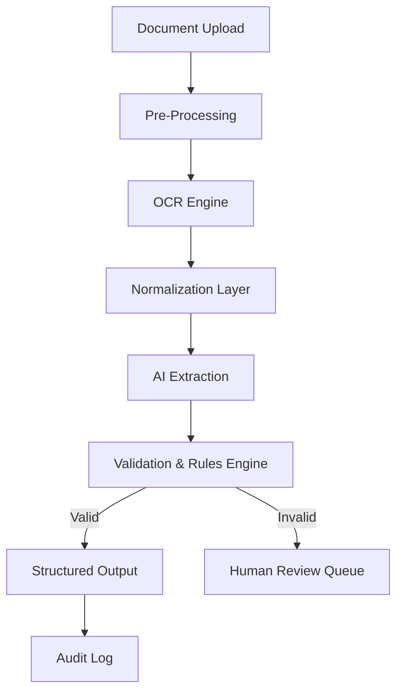

# Vishnu — Principal Production Engineer

**Backend systems • Media pipelines • AI with guardrails • Reliability-first architecture**

I build **production-grade backend systems** where correctness, determinism, and failure handling
are treated as baseline requirements—not nice-to-haves.

My work focuses on:
- Backend-first system design
- Automation and batch pipelines
- AI-enabled systems with validation and fallbacks
- Long-term maintainability under real-world failures

This repository highlights two representative projects that reflect how I design, build, and own systems in production.

---

## Project 1: FFmpeg Motion Engine (FME)

**Production-Grade Cinematic Motion Using Native FFmpeg Mathematics**

FME is a backend motion compiler that generates **human-like cinematic motion**
(shake, zoom punches, reverse bursts, speed ramps) using **pure FFmpeg `filter_complex` expressions**.

There are no GUIs, timelines, or external render engines.  
This system is designed for **automation-heavy, high-reliability media pipelines**.

### Why It Matters

Most FFmpeg motion systems fail in production due to:
- Linear interpolation → robotic motion
- Hard-coded presets → no adaptability
- Hidden math → impossible debugging
- Random behavior → unsafe retries

FME treats motion as a **compiled, deterministic system**.

### Core Guarantees
- Deterministic output (same input → same frames)
- Frame-accurate math
- Explicit, inspectable filtergraphs
- Safe retries and replays
- Container-friendly execution

### Motion Model: Attack–Peak–Decay (APD)

Motion is modeled using physically inspired envelopes:
- **Attack**: smooth acceleration (sine / cubic-bezier)
- **Peak**: controlled stabilization window
- **Decay**: exponential or damped falloff

No linear ramps. No velocity discontinuities.

### Example JSON Payload

```json
{
  "effect": "zoom_punch",
  "duration_ms": 420,
  "amplitude": 0.18,
  "attack_ms": 80,
  "peak_ms": 60,
  "decay_ms": 280,
  "easing": "sine",
  "fps": 30
}
````

### Generated Filtergraph (Simplified)

```text
scale=iw*(1+amp*sin(PI*t/dur)*exp(-decay*t)):
      ih*(1+amp*sin(PI*t/dur)*exp(-decay*t)):
      eval=frame
```

### FFmpeg CLI Example

```bash
ffmpeg -i input.mp4 \
-filter_complex "
scale=iw*(1+0.18*sin(PI*t/0.42)*exp(-4*t)):
      ih*(1+0.18*sin(PI*t/0.42)*exp(-4*t)):
      eval=frame
" \
-c:v libx264 output.mp4
```

### Validation & CI

* Strict JSON validation
* Effect-specific bounds enforcement
* Determinism tests on filtergraph output
* Failure injection (invalid payloads never reach FFmpeg)

This engine is designed to run **unattended at scale**.

---

## Project 2: Reliable Document Intelligence Pipeline (RDIP)

**Backend-First Document Processing with AI Guardrails**

RDIP is a production system for **ingesting, validating, and extracting structured data**
from documents (PDFs, scans, emails) using **deterministic pipelines with AI as a controlled component**.

This project demonstrates how I design **AI-enabled systems that remain safe under failure**.

### Why It Matters

Most document automation systems fail because:

* OCR output is noisy
* LLMs hallucinate silently
* Business logic is mixed with AI calls
* Errors surface only downstream

RDIP treats AI as **probabilistic**, never authoritative.

### System Architecture



### Key Design Principles

**AI is not the source of truth**

* AI produces candidates
* Validation enforces correctness
* Humans handle irreducible ambiguity

**Explicit state transitions**

```
RECEIVED → OCR_COMPLETE → AI_EXTRACTED → VALIDATED → FINALIZED
```

**Idempotent by design**

* Safe retries
* Reprocessing without duplication
* Deterministic outcomes

### Example AI Output Contract

```json
{
  "invoice_number": "INV-0182",
  "invoice_date": "2024-11-12",
  "vendor_name": "Acme Supplies Ltd",
  "total_amount": 1834.50,
  "currency": "USD"
}
```

### Validation Rules (Examples)

* Dates cannot be in the future
* Totals must be positive
* Currency must match vendor profile
* Line-item sum must equal invoice total

Failures route to **human review**, never silent acceptance.

### Failure Injection & CI

* Simulated OCR noise
* AI hallucination tests
* Retry safety checks
* Deterministic replays

Designed for **finance, operations, and compliance-heavy workflows**.

---

## Engineering Philosophy

I design systems assuming:

* Upstream inputs will be wrong
* Downstream dependencies will fail
* Scale will arrive earlier than expected
* Someone else will debug this at 3 AM

I prioritize:

* Explicit contracts over magic
* Determinism over cleverness
* Reliability over demos
* Long-term maintainability over shortcuts

---

## Ideal Client Use Cases

* Automated video or media pipelines
* Backend-heavy products with real business risk
* AI systems that must be validated, not trusted blindly
* Legacy automation that needs stabilization
* Systems that must survive audits and scale

---

## Author

**Vishnu**
Principal Production Engineer

Backend systems • Media pipelines • AI validation • Automation reliability

---

## License

MIT

```

